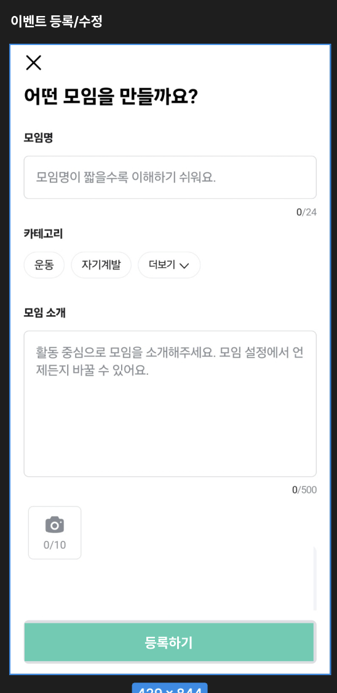

# 기본적인 분석 
## ImageTable

```txt
Event 를 생성하는 API 이다.
Event 등록을 위한 화면을 다음과 같이 구성할 것이라고 팀원들과 소통했다.

그때 얘기 나눴던 것들 중하나가 이벤트 등록 시 
이벤트 소개를 위한 이미지를 넣을 수 있게 한다고 하였다. 

화면 처럼 만든다면, 
이벤트 처음 생성시 서버로 파일데이터가 와야한다는 것이다. 
( 다행이도 생성 시에는 하나의 이미지 파일만 받자고 얘기했었다. )
```

## Category 
```txt
이벤트 생성 시 Category 가 이미 존재해야할 것 같다. 
category_id 는 필수 이다. 
Clietn 로 부터 Category_id 를 전달 받아야한다. 
```

## Location
```txt
우리는 장소를 String 에서 Location 이라는 객체를 만들어서 
해당 객체의 아이디를 사용하자고 했었다. 
Category 와 마찬가지로 미리 Location 정보가 생성되어 있어야하며
client 로 부터 Location Id 를 전달 받아야한다.
```

## 정리
```
간단하게 알아본 분석 결과 
이벤트를 생성하기 위한 절차는 다음과 같이 수행할 것이다.

1. 사용자의 토큰을 받아서 사용자가 이벤트를 생성할 수 있는지 확인한다 ( 최대 10 개 )
2. 이벤트 생성 시 파일이 존재하면 파일의 타입을 확인 (JPEG, JPG, PNG 만 )
3. 이벤트 생성하기 위한 검증 후 파일 저장 
    1. 이름 검증 
    2. 날짜 검증 
    3. 소개 글 30 글자 이상 
    4. Category 가 유효한지
    5. Location 이 유효한지 
4. 파일을 저장하고 파일의 저장 위치를 반환 후 ImageTable 에 레코드를 생성 

-> 이렇게 하는 이유는 이미지 저장시 오류가 있어도 이벤트 생성은 확실하게 하고 싶어서 그렇다. 
```

# 코드 수정해야할 부분 
## API 
=> BEFORE
```java
    @Operation(summary = "이벤트 생성 API", description = "이벤트를 생성합니다.")
    @PostMapping("")
    public ApiResponse<CreateEvent.Response> createEvent(@Parameter(description = "이벤트 생성 정보") @RequestBody CreateEvent.Request request) {
        return ApiResponse.ok(CreateEvent.Response.create());
    } 
```
```txt
수정해야할 부분, 
파일을 수신 받는 부분이 없음, 
사용자를 대변하는 토큰이 존재하지 않음 
```
=> AFTER
```java    
    @Operation(summary = "이벤트 생성 API", description = "이벤트를 생성합니다.")
    @PostMapping(value = "",consumes = MediaType.MULTIPART_FORM_DATA_VALUE)
    public ApiResponse<CreateEvent.Response> createEvent(
            @RequestHeader("Authorization") String token,
            @Parameter(description = "이벤트 생성 정보")    @RequestPart CreateEvent.Request request,
            @Parameter(description = "이벤트 썸네일 파일")  @RequestPart(value = "image",required = false)MultipartFile imageFile) {
        return ApiResponse.ok(CreateEvent.Response.create());
    }
```