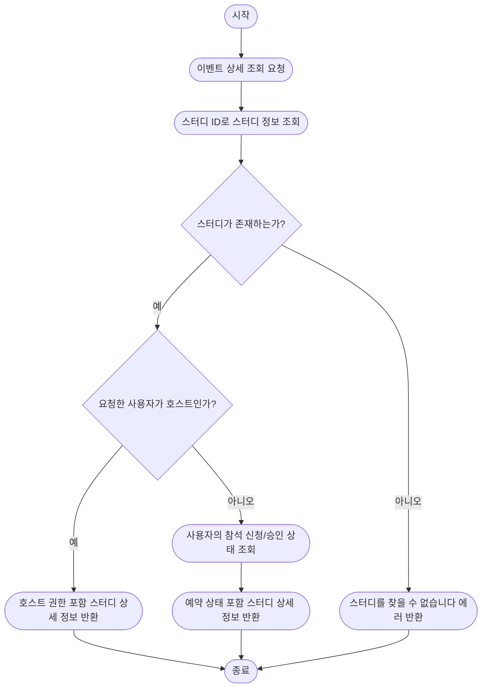
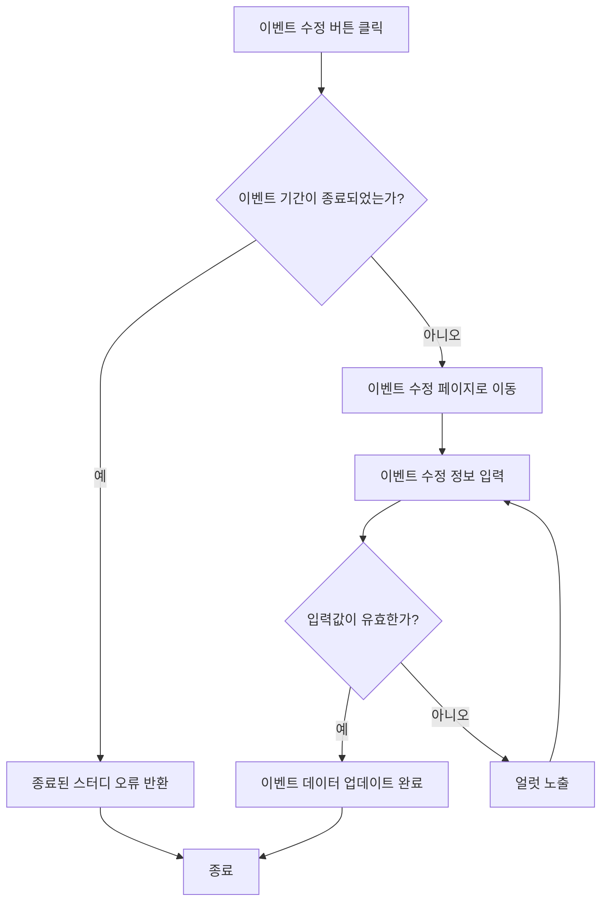
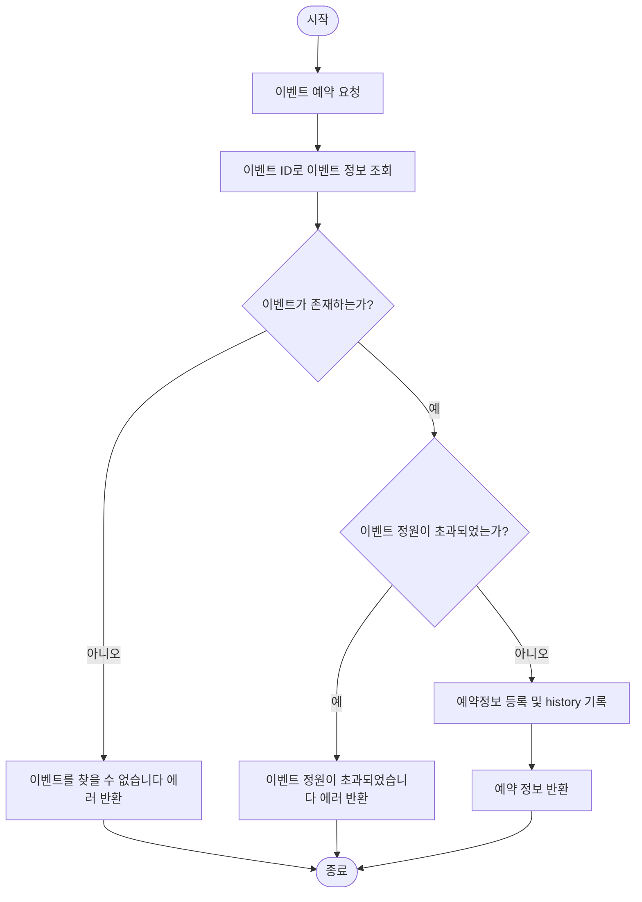
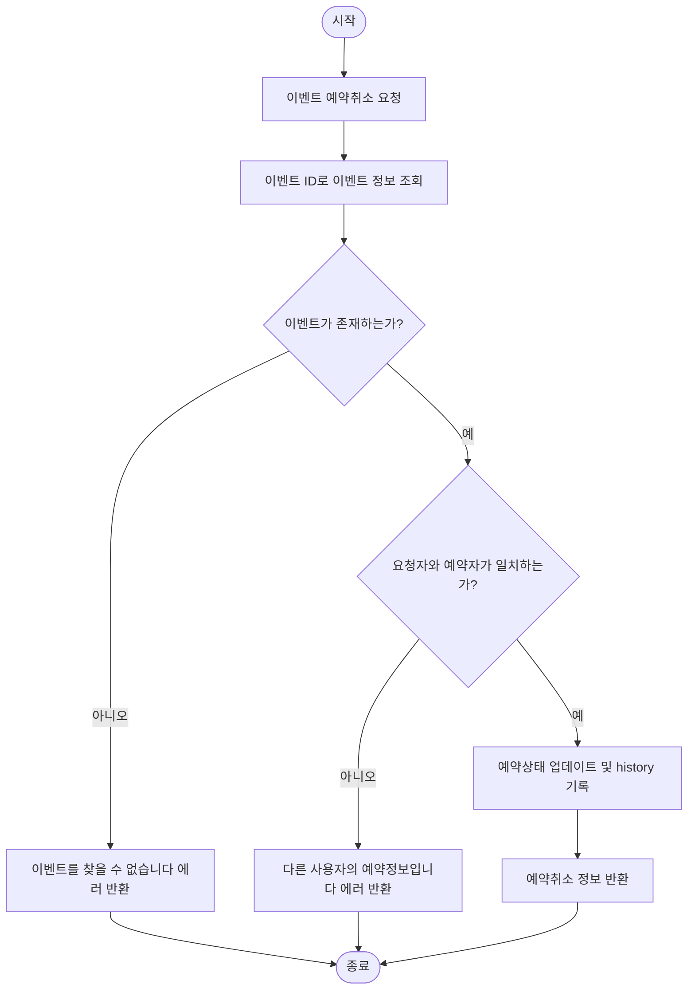

# FlowChart

- [이벤트 목록 조회](#이벤트-목록-조회)
- [이벤트 상세조회](#이벤트-상세-조회)
- [이벤트 등록](#이벤트-등록)
- [이벤트 수정](#이벤트-수정)
- [이벤트 예약/예약취소](#이벤트-예약예약취소)

## 이벤트 목록 조회

## 이벤트 상세 조회

## 이벤트 등록

## 이벤트 수정

## 이벤트 예약/예약취소
### 이벤트 예약

### 이벤트 예약취소
