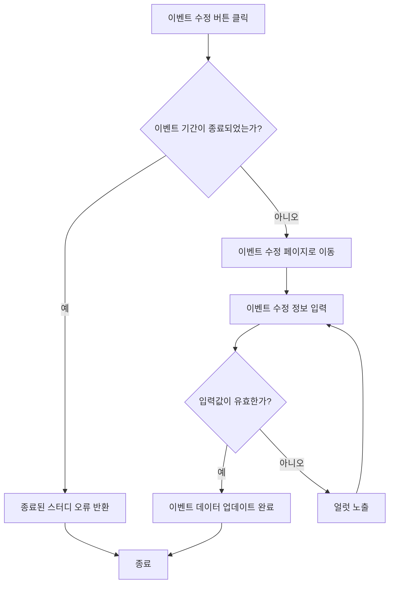

## 이벤트 수정

```mermaid
flowchart TD
    A[이벤트 수정 버튼 클릭] --> B{이벤트 기간이 종료되었는가?}
    B -- 예 --> C[종료된 스터디 오류 반환]
    C --> I[종료]
    B -- 아니오 --> D[이벤트 수정 페이지로 이동]
    D --> E[이벤트 수정 정보 입력]
    E --> F{입력값이 유효한가?}
    F -- 예 --> G[이벤트 데이터 업데이트 완료]
    F -- 아니오 --> H[얼럿 노출]
    H --> E
    G --> I[종료]
```