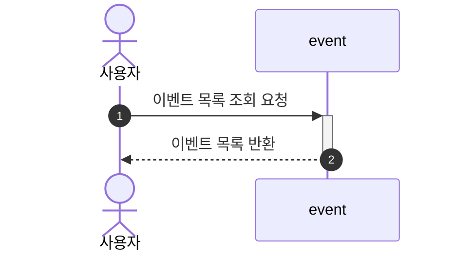
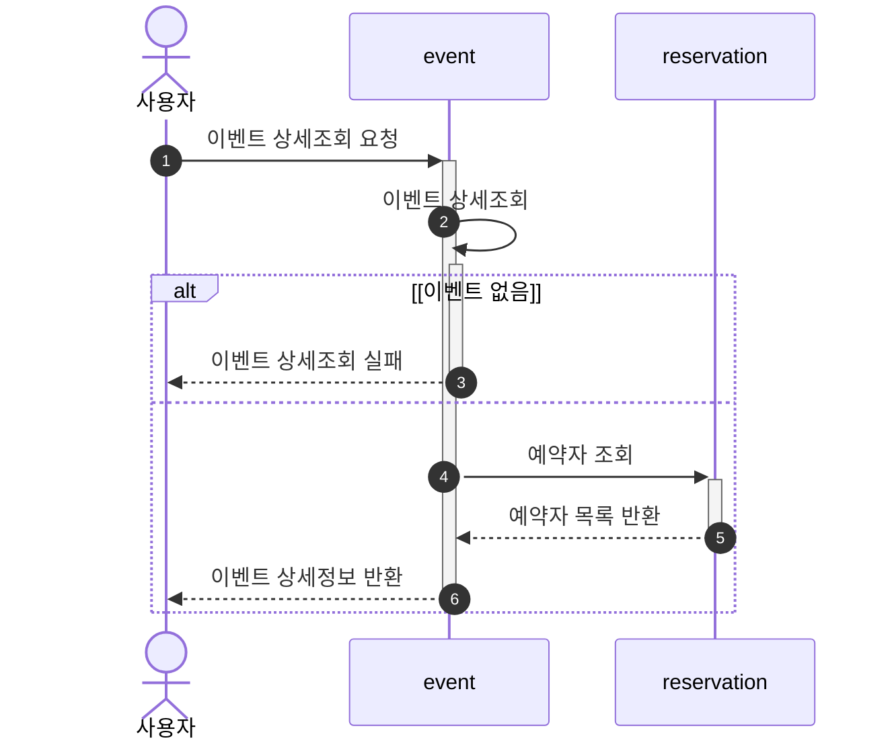
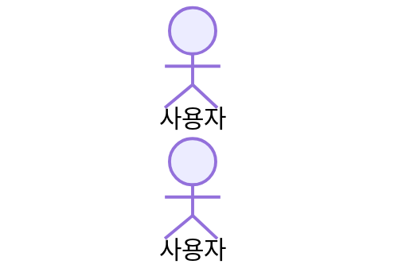

# SequenceDiagram

- [이벤트 목록 조회](#%EC%9D%B4%EB%B2%A4%ED%8A%B8-%EB%AA%A9%EB%A1%9D-%EC%A1%B0%ED%9A%8C)
- [이벤트 상세조회](#%EC%9D%B4%EB%B2%A4%ED%8A%B8-%EC%83%81%EC%84%B8%EC%A1%B0%ED%9A%8C)
- [이벤트 등록](#%EC%9D%B4%EB%B2%A4%ED%8A%B8-%EB%93%B1%EB%A1%9D)
- [이벤트 수정](#%EC%9D%B4%EB%B2%A4%ED%8A%B8-%EC%88%98%EC%A0%95)
- [이벤트 예약/예약취소](#%EC%9D%B4%EB%B2%A4%ED%8A%B8-%EC%98%88%EC%95%BD%EC%98%88%EC%95%BD%EC%B7%A8%EC%86%8C)

## 이벤트 목록 조회

## 이벤트 상세조회

## 이벤트 등록

## 이벤트 수정

## 이벤트 예약/예약취소

// TODO: 주최자 전용 기능, 로그인(소셜 로그인)
